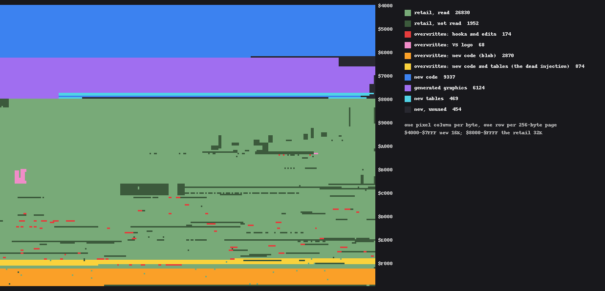

# Pole Position II VS -- the current design

This page describes the build as it stands at **checkpoint 89**. It is the
reference; `docs/FINDINGS.md` is the history (why each piece is the way it is,
wrong turns included), and `patches/splitscreen.py` is the source, with the
reasoning next to each edit. To build it, see the README ("Pole Position II
VS: building it").

## What it is

A 48K cartridge ($4000-$FFFF) built from the retail 32K. Two players race at
once: player 2 on the top half of the screen, player 1 on the bottom, the HUD
between them as a divider. Each player has their own car, camera, track
position, steering, gears, collisions, crashes, laps, clock, score and
result; the rival traffic is shared.

| Feature | Since | Where (patches/splitscreen.py) | Switch |
|---|---|---|---|
| Two views, the HUD as a divider | 7, 12 | `dll_template`, `HudReassert`, divider palettes | |
| Player 2's own camera, track walk and drive | 13-19, 57 | `p2_walk_src`, `P2Tick`, `P2Physics`, `P2Geom` | |
| Player 2's car, lean and wheels, drawn from its own state | 26-32, 82 | `p2_car_src` | |
| Each car in the other's view, as the game draws a rival | 49-58 | `rival_car_src` (`RivalCars`, `OcSprite`, `OcRow`) | |
| Player 2 sees and hits the world's objects | 60-64 | `P2Emit`, `P2Collide`, `P2Wreck` | |
| Grid, HUD, player-vs-player contact, audio | 65-68 | | |
| Qualifying for both, the race, sitting out | 69-71, 80 | `P2Line`, `QualHold`, `QualOut` | |
| Cars-passed bonus for player 2 | 73 | `P2Pass` | |
| Player 2's skybox, turning with player 2 | 77 | `P2Sky` | |
| Player 2's qualifying result, the two-player game-over result | 78, 79 | `QMsg` | |
| 1ST/2ND on the HUD | 81 | `HudFill` | |
| Player 2's highlights (design: Defender_2600) | 83 | `p2_overlay_art` | `PP2_NO_OVL` |
| Both players' bonuses tallied on screen | 84 | `TallyT`, `TallyC`, `TallyEnd`, `QmTally` | |
| VS in the title logo | 85 | `TITLE_VS` | `PP2_NO_VS` |
| Far bands 1-5 smoothed (pre-sheared road slices; band 1 +/-4 px a line, 2-3 +/-4, 4-5 +/-3) | 86 | `smooth_art`, `SmSelect`, `SmApply` | `PP2_NO_SMOOTH` |
| Near bands 8-11 smoothed (+/-1 px a line, the line re-split into two pieces) | 89 | `_slices_build`, `SmSelect`, `SmApply` (`SnLoop`), the stage | `PP2_NO_NEAR` |
| Far bands 1-7 split in two, a stripe per half | 87 | `top_half_src`, `P2TopStage` | `PP2_NO_SPLIT` |
| The object pass's row search by halving | 88 | `zrow_up_src` | `PP2_LINEAR_CE3E` (test) |
| The higher-detail car (KevinMos3 and Defender_2600); player 2's highlights gold on it | after 89 | `HIRES_CAR`, `car_colours`, `car_rom`, `ovl_pw` | `PP2_HIRES_CAR` (off by default; bundle option `vs-hires-car`) |

## What runs when

The game's structure is unchanged: a main loop that advances the race once
every six frames (a "tick", 10 Hz) and a chain of display interrupts (DLIs)
that runs every frame (60 Hz). The build adds to both.

**Main loop, each tick** (rom:D701 onward, the race tick):
- `P2Tick` (rom:D713 and rom:D8BC): player 1's track walk (rom:E93D), then
  player 2's drive (`P2Physics`) and its walk (`P2Geom`, both halves), then
  `SmSelect` picks the road slices for far bands 1-5 and near bands 8-11.
  `TICK_BUSY` is set throughout, so the frame side never reads a
  half-written curve.
- `CarTick` (rom:D70D) and `RivalCars` (rom:D716): the object tick and the
  object list, with each player's car added to the other's view.
- At the object rebuild, once vblank has begun (rom:E70D): `P2ObjCommit` --
  player 2's emitter (`P2Emit`), `TopCopy2`, the game's own rebuild
  (rom:E6D7), `TopCopy1`. The copies put each far band's first two objects
  into its top half's list.

**Every frame**, down the screen (zone numbers are in the table below):
- Zone 0, DLI index 7: the sky's palettes (`SkyHold`).
- Zone 4, index 13 (`P2SkyEnd`): player 2's horizon line, then the road's
  palettes for player 2's view (`MirrorPalette`).
- Zones 5-23: player 2's road; index 8 on zone 23.
- Zone 24, index 9: the divider's palettes; zones 25-27 the HUD, index 10 on
  the third row.
- Zones 28-29: player 1's horizon and decor; index 11 on the decor runs the
  stock palette block and then `RoadTail` (the horizon line, the ground, the
  cars' palettes, player 2's stripe phase), `E8Lite` builds the stripe rows
  the bands read (odd frames), and the handler ends in `VbSplit`, which runs
  `QMsg` (the divider's message rows) and `P2Sky`.
- Zones 30-48: player 1's road.
- Zone 49, index 12 (`VbTail`): stages the curve values for the next frame
  (unless the tick is mid-write), applies new road slices (`SmApply`: the
  headers' graphics, and for the near bands a width delta and x offset into
  `NEAR_DB`/`NEAR_NX`), then
  the stock frame-end, whose hook (rom:F16B) runs `MirrorStage`: the decor
  lists, each band's width and x for both views (the far bands' slice
  adjustments included), player 2's car and highlights.

## What is left in the budget

- **Speed:** the stress scenario (both cars at 240 in traffic) runs 100 race
  ticks per 600 frames, the stock rate, at checkpoints 88 and 89.
- **ROM:** essentially full. The code area ends at `$63AA` (limit `$63FF`,
  85 bytes spare); the `$7E` code block has 10 of 216 bytes spare; the four
  slice columns are packed to within ~30 bytes a line; the table windows in
  `$7C/$7D/$7F` have ~150 bytes left in pieces. More would mean compacting
  code (each loop costs some speed) -- FINDINGS, checkpoint 89.
- **RAM:** the "RAM still free" table below, about 70 bytes in pieces; zero
  page is fully used.

## Known limits

- Band 12, the nearest, still steps on bends (its right piece is already 31
  bytes, and there was no ROM left for it).
- Band 1's stripes (2.5 rows long) are still coarser than stock at half-band
  resolution.
- A far band's third object, or one in an unexpected slot, draws in the
  band's bottom half only (rare).
- In player 1's view, player 2's car has highlights only at the nearest size;
  further ahead it looks like a gold rival (with the higher-detail car, like
  player 1's blue and white one).
- The retail car hack's own bundle (`dist/pp2-graphics-hack.abp`) does not
  stack with this build: its car-palette bytes `$EDE3`/`$EDE7` are in the
  reclaimed injection. The VS build carries the redraw itself instead
  (`PP2_HIRES_CAR`, bundle option `vs-hires-car`).
- Recordings replay against the unsigned build; a signed build (for
  hardware) plays them back differently (README).

## What the ROM is made of

Every byte of the 48K image, classified by `tools/vs-rom-map.py` (build
against the retail dump, plus ROM coverage from six recordings and two
scripted races -- "read" is a lower bound on what play uses):

| bytes | of 48K | what |
|---:|---:|---|
| 26,830 | 54.6% | retail, unchanged, read in play |
| 1,952 | 4.0% | retail, unchanged, never read in these runs |
| 174 | 0.4% | retail, overwritten: hooks and edits |
| 68 | 0.1% | retail, overwritten: the VS logo |
| 2,870 | 5.8% | new code in the retail ROM's own free space (`$F400-$FF46`, all `$FF` in the retail) |
| 874 | 1.8% | new code and tables where the bypassed scanline injection was (`$EDA0-$F142`) |
| 9,337 | 19.0% | new code (`$4000-$63AA` and the `$7E` block) |
| 6,124 | 12.5% | generated graphics (5,484 sheared road slices, 640 the highlight column) |
| 469 | 1.0% | new tables |
| 454 | 0.9% | unused |

So 28,782 of the retail 32,768 bytes (87.8%) are still there unchanged, and
26,830 of them are read in play: 15,526 in `$8000-$BFFF` (graphics and
tables), 11,304 in `$C000-$FFFF` (code). Retail content actually replaced is
242 bytes (hooks and the logo), plus the 874-byte injection the mod no
longer runs. The mod's own bytes come to 19,916 (40.5% of the image),
including 6,192 generated at build time from the retail's own pixels.

## Checking a build

    MAME=/path/to/mame tools/check-build.sh pp2-vs.a78

runs the regression set used since checkpoint 80 and prints what to compare
(the expected values are in the script's header). Set `PP2_HIRES_CAR=1` for
the higher-detail build, so the checks read its symbols. The unsigned build's
SHA-256 is in the README; the generator refuses any dump but the retail one.

## Words used here and in the source

- **band**: one of the road's 13 horizontal strips, 6 lines each; band 0 (the
  horizon) is not drawn in either view. Far bands 1-7 draw the road as one
  object, near bands 8-12 as two.
- **zone**: an entry in MARIA's zone list; a band is one zone, or two 3-line
  zones since checkpoint 87 (the top half from its own short list).
- **slice**: a band's six lines of road graphics; a *sheared* slice is a copy
  with each line offset to follow the band's slope.
- **mirror**: the top view's original form (checkpoints 1-18), a copy of
  player 1's road lists; `MirrorStage`, `MirrorInit` and `MirrorPalette` keep
  the name.
- **tick**: one race update, every six frames.
- **ck N**: checkpoint N in docs/FINDINGS.md (and a saved build of it).

## Maps

Generated by `tools/splitscreen-maps.py` from the generator itself; rerun it
after changing the layout.

### Zone list (51 zones at $2500, 249 lines)

| zone | first line | lines | DLI | list | draws |
|---:|---:|---:|:-:|---|---|
| 0 | 0 | 16 | x | $24F6 | blank |
| 1 | 16 | 4 |  | $24F6 | blank |
| 2 | 20 | 2 |  | $1B30 | player 2's horizon |
| 3 | 22 | 8 |  | $1B9C | player 2's decor (top 8 lines) |
| 4 | 30 | 2 | x | $1B00 | player 2's decor (last 2) |
| 5 | 32 | 3 |  | $2200 | player 2, band 1 top half |
| 6 | 35 | 3 |  | $2600 | player 2, band 1 |
| 7 | 38 | 3 |  | $220E | player 2, band 2 top half |
| 8 | 41 | 3 |  | $2612 | player 2, band 2 |
| 9 | 44 | 3 |  | $221C | player 2, band 3 top half |
| 10 | 47 | 3 |  | $2624 | player 2, band 3 |
| 11 | 50 | 3 |  | $210F | player 2, band 4 top half |
| 12 | 53 | 3 |  | $2636 | player 2, band 4 |
| 13 | 56 | 3 |  | $211D | player 2, band 5 top half |
| 14 | 59 | 3 |  | $2648 | player 2, band 5 |
| 15 | 62 | 3 |  | $212B | player 2, band 6 top half |
| 16 | 65 | 3 |  | $265A | player 2, band 6 |
| 17 | 68 | 3 |  | $1BCA | player 2, band 7 top half |
| 18 | 71 | 3 |  | $266C | player 2, band 7 |
| 19 | 74 | 6 |  | $2682 | player 2, band 8 |
| 20 | 80 | 6 |  | $26A0 | player 2, band 9 |
| 21 | 86 | 6 |  | $26BA | player 2, band 10 |
| 22 | 92 | 6 |  | $26D0 | player 2, band 11 |
| 23 | 98 | 6 | x | $26E6 | player 2, band 12 |
| 24 | 104 | 6 | x | $24F6 | blank |
| 25 | 110 | 7 |  | $7FE0 | divider row 1 (2UP) |
| 26 | 117 | 7 |  | $7FEC | divider row 2 (1UP) |
| 27 | 124 | 7 | x | $7FF8 | divider row 3 |
| 28 | 131 | 10 |  | $18FA | player 1's horizon (stock) |
| 29 | 141 | 10 | x | $1D3B | player 1's decor (stock) |
| 30 | 151 | 3 |  | $2599 | player 1, band 1 top half |
| 31 | 154 | 3 |  | $2326 | player 1, band 1 |
| 32 | 157 | 3 |  | $25A7 | player 1, band 2 top half |
| 33 | 160 | 3 |  | $234C | player 1, band 2 |
| 34 | 163 | 3 |  | $25B5 | player 1, band 3 top half |
| 35 | 166 | 3 |  | $2372 | player 1, band 3 |
| 36 | 169 | 3 |  | $25C3 | player 1, band 4 top half |
| 37 | 172 | 3 |  | $2398 | player 1, band 4 |
| 38 | 175 | 3 |  | $25D1 | player 1, band 5 top half |
| 39 | 178 | 3 |  | $23BE | player 1, band 5 |
| 40 | 181 | 3 |  | $25DF | player 1, band 6 top half |
| 41 | 184 | 3 |  | $2400 | player 1, band 6 |
| 42 | 187 | 3 |  | $25ED | player 1, band 7 top half |
| 43 | 190 | 3 |  | $2426 | player 1, band 7 |
| 44 | 193 | 6 |  | $244C | player 1, band 8 |
| 45 | 199 | 6 |  | $246E | player 1, band 9 |
| 46 | 205 | 6 |  | $2490 | player 1, band 10 |
| 47 | 211 | 6 |  | $24B2 | player 1, band 11 |
| 48 | 217 | 6 |  | $24D4 | player 1, band 12 |
| 49 | 223 | 10 | x | $24F6 | blank |
| 50 | 233 | 16 |  | $24F6 | blank |

### RAM the build claims

| name | from | to | bytes |
|---|---|---|---:|
| P2_HEAD | $0060 | $0064 | 5 |
| E8L_T | $0065 | $0066 | 2 |
| SM | $0067 | $0091 | 43 |
| ZU | $0092 | $0093 | 2 |
| SM_NIX | $0094 | $009B | 8 |
| P2_DECOR_DL | $1B00 | $1B2D | 46 |
| P2_HOR_DL | $1B30 | $1B35 | 6 |
| P2_DECOR_TOP | $1B9C | $1BC9 | 46 |
| P2_TOP7 | $1BCA | $1BD7 | 14 |
| STG | $1C38 | $1C51 | 26 |
| QM | $1FF3 | $2020 | 46 |
| HUD_POS | $2021 | $2026 | 6 |
| P2_QUAL | $2027 | $202C | 6 |
| P2_TBS | $202D | $202D | 1 |
| NEAR | $202E | $203F | 18 |
| P2_TOP4 | $210F | $211C | 14 |
| P2_TOP5 | $211D | $212A | 14 |
| P2_TOP6 | $212B | $2138 | 14 |
| P2_TOP1 | $2200 | $220D | 14 |
| P2_TOP2 | $220E | $221B | 14 |
| P2_TOP3 | $221C | $2229 | 14 |
| DLL | $2500 | $2598 | 153 |
| P1_TOP1 | $2599 | $25A6 | 14 |
| P1_TOP2 | $25A7 | $25B4 | 14 |
| P1_TOP3 | $25B5 | $25C2 | 14 |
| P1_TOP4 | $25C3 | $25D0 | 14 |
| P1_TOP5 | $25D1 | $25DE | 14 |
| P1_TOP6 | $25DF | $25EC | 14 |
| P1_TOP7 | $25ED | $25FA | 14 |
| P2_DL_BASE | $2600 | $26F7 | 248 |
| P2_LATERAL | $2702 | $2702 | 1 |
| P2_SCRATCH | $2703 | $2709 | 7 |
| P2_PHASE | $270A | $270F | 6 |
| P2_STEP_HI | $2710 | $2710 | 1 |
| P2_STAGE_TMP | $2715 | $2715 | 1 |
| P2_DRIFT | $2716 | $2718 | 3 |
| OC | $2719 | $271F | 7 |
| P2_WALK | $2720 | $272A | 11 |
| P2_RACE | $2730 | $2736 | 7 |
| TICK_BUSY | $2737 | $2737 | 1 |
| P2_PASS | $2738 | $273F | 8 |
| OC2 | $2740 | $2742 | 3 |
| P2_ST | $2743 | $2744 | 2 |
| OC3 | $2745 | $274E | 10 |
| P2_TRACK | $2750 | $2752 | 3 |
| P2_SPEED | $2753 | $2753 | 1 |
| P2_CAR_DELTA | $2754 | $2754 | 1 |
| P2_FRAC | $2755 | $2755 | 1 |
| P2_HALF | $2756 | $2757 | 2 |
| P2_QUOT | $2758 | $2758 | 1 |
| GAP | $2759 | $275F | 7 |
| P2_BANDX | $2760 | $276C | 13 |
| P2_HIT | $276D | $276E | 2 |
| P2_HUD | $2770 | $277B | 12 |
| P2SLOTS | $277C | $278F | 20 |
| P2L_KIND | $2790 | $2790 | 1 |
| P2_WORLD | $2791 | $2794 | 4 |
| CAR_FRAME | $2795 | $27A4 | 16 |
| CAR_WORLD | $27A5 | $27B4 | 16 |
| P2_HAZARD | $27B5 | $27C1 | 13 |
| HUD_BUFS | $27C2 | $27FF | 62 |

### RAM still free

| from | to | note |
|---|---|---|
| $1B36 | $1B4D | RowCurveXStaged's tail: the dead curve copy's target (patched out) |
| $1BD8 | $1BE9 | RowCurveXStagedSrc's tail: the stripped walk tail's output |
| $2139 | $213F | untouched (below the stack's reach) |
| $222A | $2233 | stock race DLL, replaced by DLL_BASE; untouched |
| $25FB | $25FF | past the end of DLL_BASE's 51 zones and the top-half lists |

### ROM layout (48K, $4000-$FFFF)

| from | to | what |
|---|---|---|
| $4000 | $63AA | new code area (`_ext()`), 9131 bytes; limit $63FF |
| $7028 | $75FF | sheared road slices: pages $70-$75, low bytes $28-$FF |
| $7628 | $7BFF | sheared road slices: pages $76-$7B, low bytes $28-$FF |
| $6A00 | $6FFF | sheared road slices: pages $6A-$6F, low bytes $00-$FF |
| $6400 | $69FF | sheared road slices: pages $64-$69, low bytes $00-$FF |
| $7000 | $7F27 | player 2's highlight column: 16 pages, low bytes $00-$27 |
| $7E28 | $7EF5 | code kept in the $7E window (TopInit, SmQ, SmPick1), 206 of 216 bytes |
| $7C28 | $7C89 | table TopTpl |
| $7C8A | $7CDE | table SmDiv |
| $7CDF | $7CEA | table NAlo |
| $7CEB | $7CF6 | table NAhi |
| $7CF7 | $7CFE | table NLstLo |
| $7D28 | $7D50 | table SmLo |
| $7D51 | $7D79 | table SmHi |
| $7D7A | $7DA2 | table SmW |
| $7DA3 | $7DCB | table SmDx |
| $7DCC | $7DD7 | table NBlo |
| $7DD8 | $7DE3 | table NBhi |
| $7DE4 | $7DEF | table NDb |
| $7DF0 | $7DFB | table NDxb |
| $7F28 | $7F2F | table NLstHi |
| $7F30 | $7F37 | table NBase |
| $7FE0 | $7FF9 | the divider's row lists |
| $8000 | $FFFF | the retail 32K, changed in the ranges below |

### Ranges changed in the retail 32K (73 ranges, 4034 bytes)

| from | bytes | first described at (patches/splitscreen.py line) |
|---|---:|---|
| $A5D6 | 4 | 1789 |
| $A6BE | 1 | 6980 |
| $A6C1 | 1 | 6990 |
| $A6D3 | 1 | 6981 |
| $B00E | 4 | 1799 |
| $B10A | 8 | 1808 |
| $B20A | 8 | 1807 |
| $B30A | 8 | 1806 |
| $B40A | 8 | 1805 |
| $B50A | 8 | 1804 |
| $B60A | 8 | 1803 |
| $B70A | 8 | 1802 |
| $B80A | 8 | 1801 |
| $B90A | 8 | 1800 |
| $C372 | 3 | 4391 |
| $C378 | 3 | 4400 |
| $C87E | 3 | 3822 |
| $CBE3 | 4 | 902 |
| $CBEB | 4 | 897 |
| $CC5E | 3 | 6390 |
| $CDF2 | 3 | 7125 |
| $CE0F | 3 | 7125 |
| $CE72 | 3 | 7125 |
| $CE8B | 3 | 7125 |
| $D30D | 4 | 5018 |
| $D316 | 3 | 4983 |
| $D31C | 4 | 5076 |
| $D324 | 4 | 4817 |
| $D32D | 6 | 4949 |
| $D422 | 3 | 4470 |
| $D4BC | 4 | 4817 |
| $D58D | 6 | 4917 |
| $D6A9 | 4 | 4896 |
| $D70A | 6 | 5099 |
| $D713 | 6 | 1681 |
| $D81B | 2 | 6956 |
| $D848 | 3 | 891 |
| $D8BC | 3 | 7161 |
| $D8D7 | 1 | 6966 |
| $DA92 | 2 | 6958 |
| $DB55 | 6 | 4941 |
| $DF5A | 3 | 4337 |
| $DFDA | 3 | 4362 |
| $E3CD | 3 | 2852 |
| $E4B7 | 5 | 3804 |
| $E59D | 5 | 3956 |
| $E5E8 | 5 | 3810 |
| $E617 | 4 | 3816 |
| $E70D | 3 | 1685 |
| $E79C | 3 | 6367 |
| $E8E6 | 3 | 5292 |
| $E8F8 | 2 | 7086 |
| $E90E | 2 | 7086 |
| $E935 | 2 | 7086 |
| $E9BE | 4 | 627 |
| $EA2C | 1 | 824 |
| $EBFD | 2 | 7100 |
| $EC02 | 2 | 7101 |
| $ED1E | 2 | 7002 |
| $ED29 | 2 | 986 |
| $ED42 | 5 | 917 |
| $ED48 | 2 | 7247 |
| $ED9D | 156 | 875 |
| $EE3A | 108 | 343 |
| $EEC0 | 12 | 678 |
| $EED0 | 518 | 465 |
| $F0EB | 88 | 473 |
| $F150 | 2 | 7098 |
| $F158 | 2 | 1046 |
| $F160 | 3 | 5276 |
| $F16C | 2 | 7309 |
| $F171 | 11 | 7269 |
| $F400 | 2887 | 883 |
